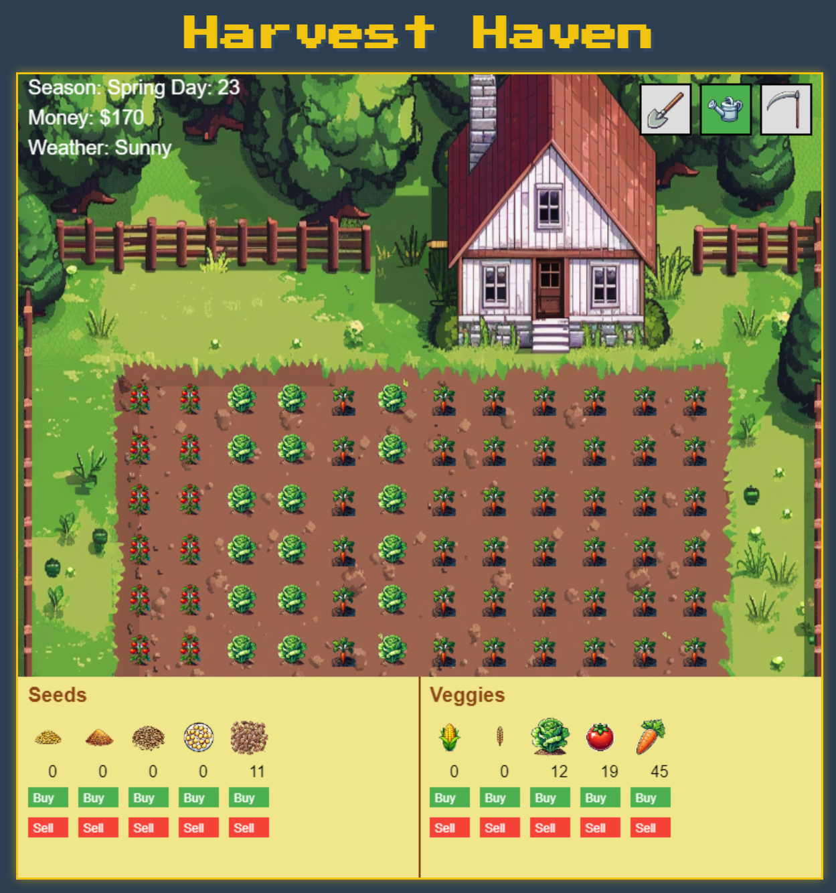

# Harvest Haven

Harvest Haven is a relaxing farming simulation game where players can grow crops, manage their farm, and enjoy the changing seasons.

## Features

- Plant and harvest various crops like corn and wheat
- Experience changing seasons that affect crop growth
- Manage your inventory and sell crops for profit
- Use different tools for farming activities
- Simple and intuitive point-and-click gameplay

## How to Play

1. Select a tool from the top of the screen:
   - Hoe: Prepare soil for planting
   - Seeds: Plant crops in prepared soil
   - Watering Can: Water your crops
   - Scythe: Harvest fully grown crops
2. Click on the field to use the selected tool
3. Manage your inventory and sell crops using the buttons at the bottom of the screen
4. Watch your farm grow and prosper through the seasons!

## Installation

1. Clone this repository or download the ZIP file
2. Ensure you have a modern web browser installed
3. Open the `index.html` file in your web browser to start playing

## Technologies Used

- HTML5
- CSS3
- JavaScript
- HTML5 Canvas for game rendering

## Development

To modify or extend the game:

1. Edit `game.js` to change game logic
2. Modify `index.html` to update the page structure or add new elements
3. Adjust styles in the `<style>` section of `index.html`

## Contributing

Contributions are welcome! Please feel free to submit a Pull Request.

## License

This project is open source and available under the [MIT License](LICENSE).

## Credits

- Game concept and development: [Your Name]
- Pixel art assets: [Asset Creator's Name or Source]

## Contact

If you have any questions or feedback, please open an issue on this repository or contact [your email or contact information].

Enjoy playing Harvest Haven!